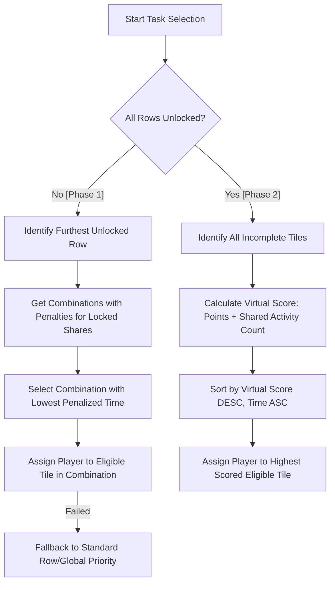

### Combo Unlocking Strategy Logic Review

The Combo Unlocking strategy is the most sophisticated strategy in the simulation. it operates in two distinct phases and aims to optimize for both row unlocking speed and activity usage efficiency.

#### 1. Task Selection Logic (Assigning work to players)

The strategy switches logic based on the overall state of the bingo board:

##### Phase 1: Row Unlocking Mode (Before all rows are unlocked)
This phase is similar to the `RowUnlocking` strategy but adds a "resource conservation" element.

1.  **Optimal Combination with Penalties**:
    - Like Row Unlocking, it finds combinations to unlock the furthest row.
    - However, it applies a **Penalty** to tiles that share activities with tiles on rows that are currently **locked**.
    - **Penalty Formula**: `PenalizedTime = BaseEstimatedTime * (1 + Number of locked tiles sharing at least one activity)`.
    - This discourages the team from completing activities that will be needed later for locked tiles, essentially saving those resources for when they are required.
2.  **Selection**: Picks the combination with the lowest **Penalized Time** and assigns the player to a tile within that combination.
3.  **Fallback**: If no tile in the optimal penalized combination is available, it falls back to the furthest row, then any unlocked row (using standard point-based priority).

##### Phase 2: Shared Activity Maximization Mode (After all rows are unlocked)
Once all rows are unlocked, the goal shifts from row speed to clearing the remaining board as efficiently as possible.

1.  **Virtual Scoring**:
    - Calculates a **Virtual Score** for every incomplete tile on the board.
    - **Score Formula**: `VirtualScore = PointValue + Number of other incomplete tiles sharing at least one activity`.
    - This prioritizes tiles that, when worked on, "overlap" with many other requirements, maximizing the team's efficiency across the whole board.
2.  **Sorting**: Tiles are sorted by Virtual Score (Descending), then Estimated Completion Time (Ascending), then Key.
3.  **Assignment**: The player is assigned to the first tile in this list for which they have the required capabilities.

#### 2. Grant Allocation Logic (Deciding where to put free progress)

1.  **Phase 1**: Identical to `RowUnlocking` (Prioritizes highest point tile on the furthest unlocked row).
2.  **Phase 2**: Identical to `Greedy` (Prioritizes highest point tile globally, then fastest completion time).

#### 3. Caching and Optimization

- **Base Combination Cache**: Caches the raw combinations for each row.
- **Penalized Combination Cache**: Caches the combinations after penalties are applied. This cache is cleared whenever *any* row is unlocked, as the penalties (which depend on which tiles are "locked") must be recalculated.

#### Summary Decision Flow

