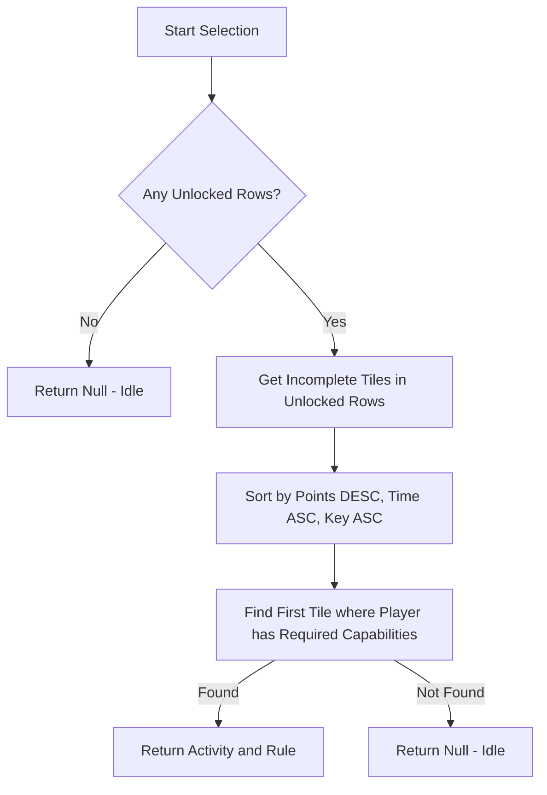

### Greedy Strategy Logic Review

The Greedy strategy is the most straightforward strategy in the simulation. It focuses on immediate point gains without considering row unlocking or long-term activity optimization.

#### 1. Task Selection Logic (Assigning work to players)

When a player is ready for a new task, the Greedy strategy follows these steps to decide what they should work on:

1.  **Identify Available Tiles**: 
    - Filters all tiles that belong to rows that have already been unlocked.
    - Excludes tiles that are already completed by the team.
2.  **Sort Tiles by Priority**:
    - **Primary**: Points (Descending) - Highest point value tiles first.
    - **Secondary**: Estimated Completion Time (Ascending) - Faster tiles first as a tie-breaker.
    - **Tertiary**: Tile Key (Alphabetical) - For deterministic behavior.
3.  **Check Player Eligibility**:
    - Iterates through the sorted list of tiles.
    - For each tile, checks if the player has the required capabilities (if any) to perform any of the activities allowed for that tile.
    - Checks if the activity definition exists in the snapshot and has at least one attempt model.
4.  **Assignment**:
    - Assigns the player to the first tile in the sorted list that they are eligible to work on.
    - If no eligible tiles are found, the player remains idle.

#### 2. Grant Allocation Logic (Deciding where to put free progress)

When the team receives a progress grant (e.g., from an outcome roll), the Greedy strategy decides the target tile as follows:

1.  **Filter Eligible Tiles**:
    - Starts with the list of tiles that are eligible to receive the specific grant (provided by the simulation runner based on unlocked rows and accepted drop keys).
2.  **Sort Tiles by Priority**:
    - **Primary**: Points (Descending) - Prioritizes putting grants into high-value tiles.
    - **Secondary**: Estimated Completion Time (Ascending) - Prioritizes faster tiles first as a tie-breaker.
    - **Tertiary**: Tile Key (Alphabetical).
3.  **Selection**:
    - Allocates the full grant to the top tile in the sorted list.

#### Summary Decision Flow

