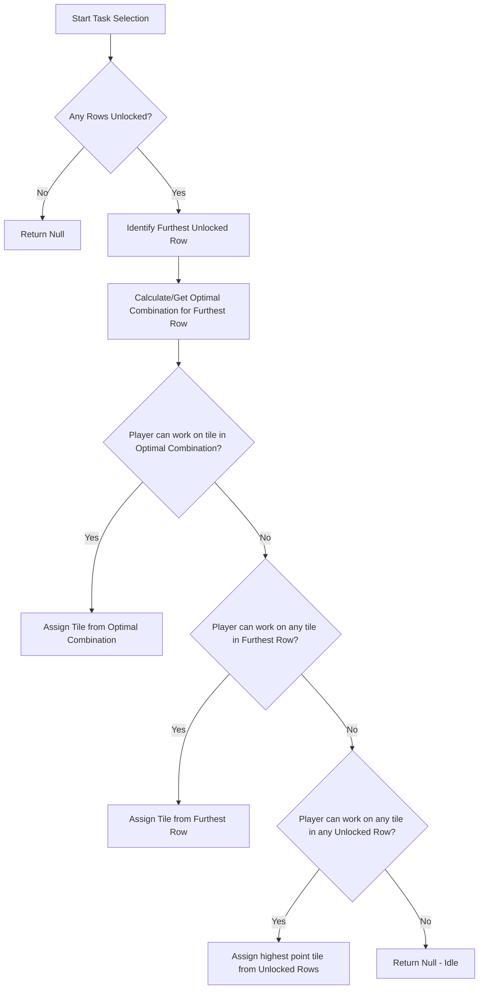

### Row Unlocking Strategy Logic Review

The Row Unlocking strategy is designed to unlock the next row of the bingo board as quickly as possible. This allows the team to access higher-value tiles or progress through the board tiers faster.

#### 1. Task Selection Logic (Assigning work to players)

The strategy uses a hierarchical priority system to assign tasks:

1.  **Identify Furthest Unlocked Row**: The strategy looks at the highest index among currently unlocked rows.
2.  **Calculate Optimal Combination**:
    - It identifies all possible combinations of incomplete tiles in that furthest row that, if completed, would meet the points threshold to unlock the *next* row.
    - It calculates the estimated time to complete each combination (sum of estimated times for all tiles in the combination).
    - The **Optimal Combination** is the one with the lowest total estimated time.
3.  **Priority 1: Target Optimal Combination**:
    - The strategy tries to assign the player to a tile that is part of the Optimal Combination.
    - Tiles within the combination are sorted by Points (Descending) then Tile Key.
    - The first tile the player is eligible for (based on capabilities) is selected.
4.  **Priority 2: Furthest Row Fallback**:
    - If the player cannot work on any tile in the optimal combination, the strategy tries to assign them to *any* incomplete tile in the furthest unlocked row.
    - Tiles are sorted by Points (Descending) then Tile Key.
5.  **Priority 3: Global Fallback**:
    - If no tiles in the furthest row are available to the player, it tries any incomplete tile in *any* unlocked row.
    - Tiles are sorted by Points (Descending), Row Index (Descending), and Tile Key.

#### 2. Grant Allocation Logic (Deciding where to put free progress)

When a grant is received, the strategy prioritizes finishing the furthest row:

1.  **Furthest Row Priority**:
    - Identifies all eligible tiles that are on the furthest unlocked row.
    - If such tiles exist, it picks the one with the highest point value (tie-break by Key).
2.  **Global Fallback**:
    - If no eligible tiles are on the furthest row, it picks the highest point tile from all eligible tiles across all unlocked rows.
    - Sorted by Points (Descending), then Row Index (Ascending - prioritizing earlier rows if points are equal), then Key.

#### 3. Caching and Optimization

- **Combination Cache**: The strategy caches the list of possible combinations for each row since the row structure is static.
- **Cache Invalidation**: When a row is unlocked or a tile is completed (the latter is intended but currently the runner calls it on row unlock), the cache for that row is invalidated to ensure the "Optimal Combination" reflects current progress.

#### Summary Decision Flow (Task Selection)

